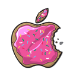

# ios_goodies_new_issue

[**iOS-Goodies**](http://ios-goodies.com/) is a newsletter crowdsourced on GitHub, `ios_goodies_new_issue` creates a new blank issue that is ready for [your contributions](https://github.com/iOS-Goodies/iOS-Goodies) after each week's publication.

## Installation

```shell
git clone https://github.com/dkhamsing/ios_goodies_new_issue.git
cd ios_goodies_new_issue/
bundle install
```
Create a `config.yml` file with a [GitHub access token](https://help.github.com/articles/creating-an-access-token-for-command-line-use/):

```yaml
token: 8c215bba8fc29580fb8b2d8222db1c68b221fake
```

Oh yeah you need push access to the [repo](https://github.com/iOS-Goodies/iOS-Goodies) :cake:

## Usage

```shell
$ ios_goodies_new_issue
ios_goodies_new_issue 0.1.0
checking latest week on http://ios-goodies.com ... 128
checking github ...
creating a new issue from template ... Week129.md
pushing to github ...
  - creating github client ...
  - pushing changes ...
  - done
finished 🍰
```

```shell
$ ios_goodies_new_issue
ios_goodies_new_issue 0.1.0
checking latest week on http://ios-goodies.com ... 128
checking github ...
up to date 🎉
```
## Contact

- [github.com/dkhamsing](https://github.com/dkhamsing)
- [twitter.com/dkhamsing](https://twitter.com/dkhamsing)

## License

This project is available under the MIT license. See the [LICENSE](LICENSE) file for more info.
